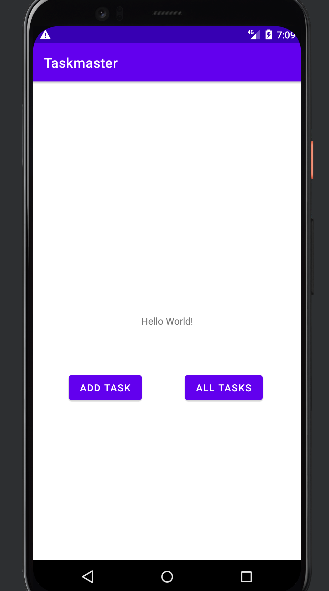
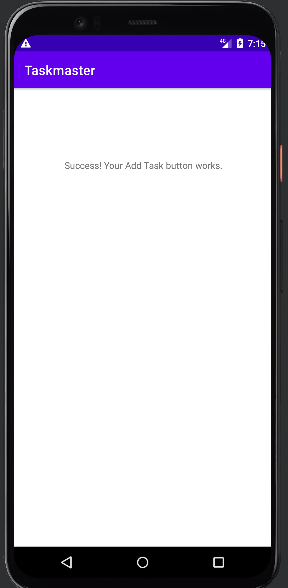
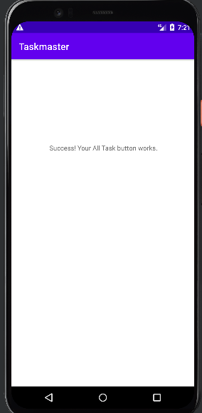
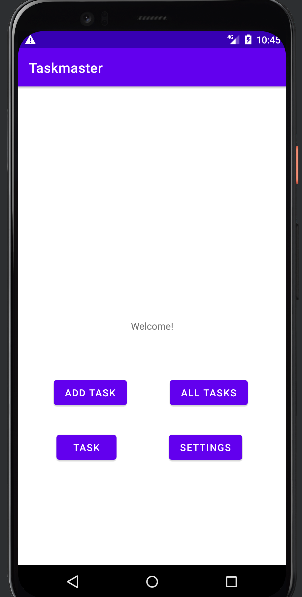
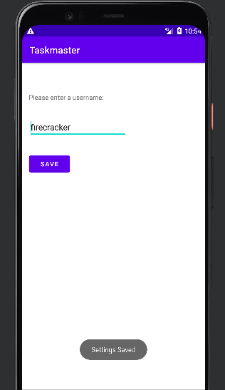
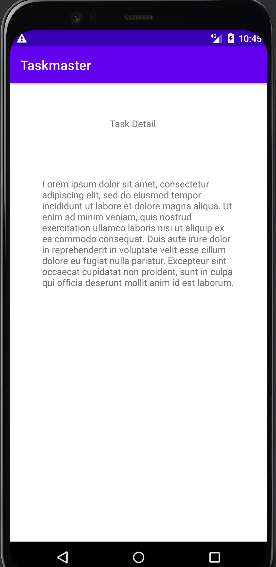
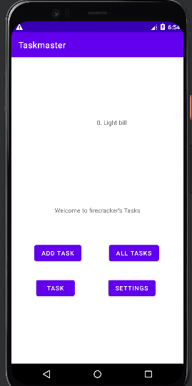
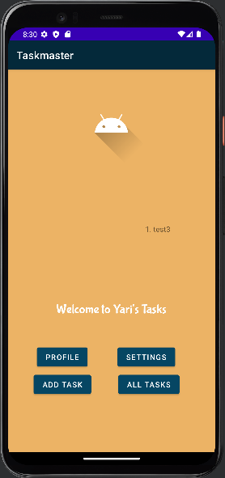
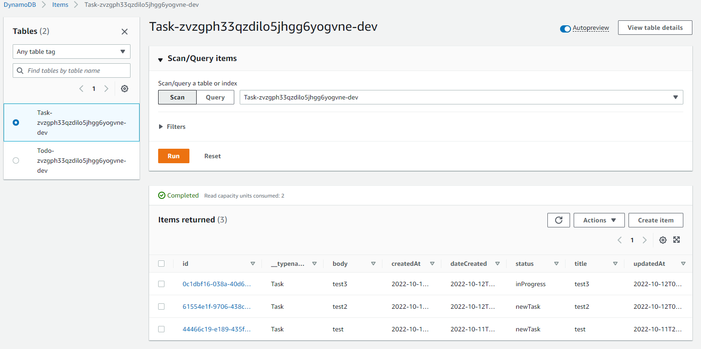

This is a mobile app designed to allow users to add tasks and view all added tasks.

**Main Activity Page**
This page contain two buttons that when clicked, will take you the their respective pages.

**Add Task Page**
Currently does not hold anything, yet.

**All Tasks Page**
Currently does not hold anything, yet.

Lab 26 9/21/2022

Lab 27 9/21/2022
**Setting Page**
This page will allow users to enter and save their name. Once they click the saved button, a "Settings saved" text appears at the bottom.

**Task Detail**
Currently does not hold anything, yet.

**User Profile Page**
This page will hold the user's name input, which when saved, will display "Welcome to {userName}'s Tasks!" in the Main Activity. That part of the code, commented out because there is an error around the @Override and the onResume(). I haven't been to debug it yet.

Lab 28 9/22/2022
**Adapter**
Created the RecyclerView adapter to enable rendering on the Main Activity.

**Fragment**
Created the TaskFragment, though I am not entirely sure how to use it, let alone what to put in the fragment xml.

**Models**
Create two models, Task, which holds the constructor for each task that will be created, and Status enum, which will hold the statuses for tasks created.

I still have some syntax issues in the Main Activity for the onResume method and the RecyclerView. Not sure how to move forward from here. Hence the reason why the app won't build, and no screenshots available to show.

Lab 29 9/24/2022

**DAO**
I created the DAO interface and linked it to the database. I have not yet entered any data to test it because the app has a few errors that I can't seem to solve yet.

**Database**
Both the task database and task converters were created, however, there are problems with both. In the database, the word entities is in read because it cannot reconcile it. I am not sure why and haven't yet found anything in research that could answer that question. In the converters, the word date is in red. Now, it is my understanding that it is something that gets passed in from Date, yet it is asking that I set a variable. 

**AddTask**
In this activity, there are two methods that were created, one in the Task model, and the other in the TaskDao interface. Neither is being recognized.

To address all the errors, I have researched on google and I have searched for syntax errors. I am not finding anything significant that would cause these errors.

Lab 31 9/27/2022

My app still has errors, some have to do with the limitations of my device. The app, which was running, is not running anymore. It gives the error, "Taskmaster stopped working". I have connected my physical android device and that didn't help. I have only written one test. You will see that there are several things that are red, although the dependencies are there and have been imported. I don't know what to do to move forward.

Lab 32 10/11/2022

Implemented and initialized AWS Amplify. Replaced Room with DynamoDB and refactored the RecyclerView to display tasks added via the AddTask form, stored in the DynamoDB table. At the moment, it adds the tasks entered into the form and displays, however, when I click the All Tasks button, the app crashes. When it did work, dispite pointing in the right direction, it would go to Settings instead of All Tasks.

Lab 33

Implemented Teams. The app is now crashing even before it launches. The few times it has launched, the moment I click one of the buttons, it crashes again. 